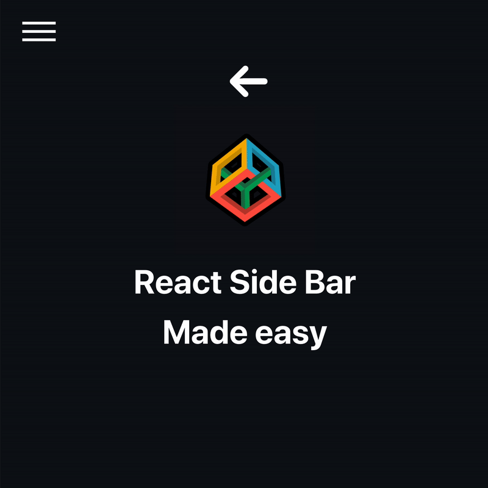

# Sticky Navbar

<p align="center"></p>

### Section 1


---

# How to install

Clone the repo
```shell
git clone <URL>
```

Cd into the cloned folder and install dependencies
```shell
cd <FOLDER>
npm install
```

Run React, this should open a page in your browser
```shell
npm run start
```

**Note:** if you don't have `nodejs` installed go to [this link](https://nodejs.org/en/download/)